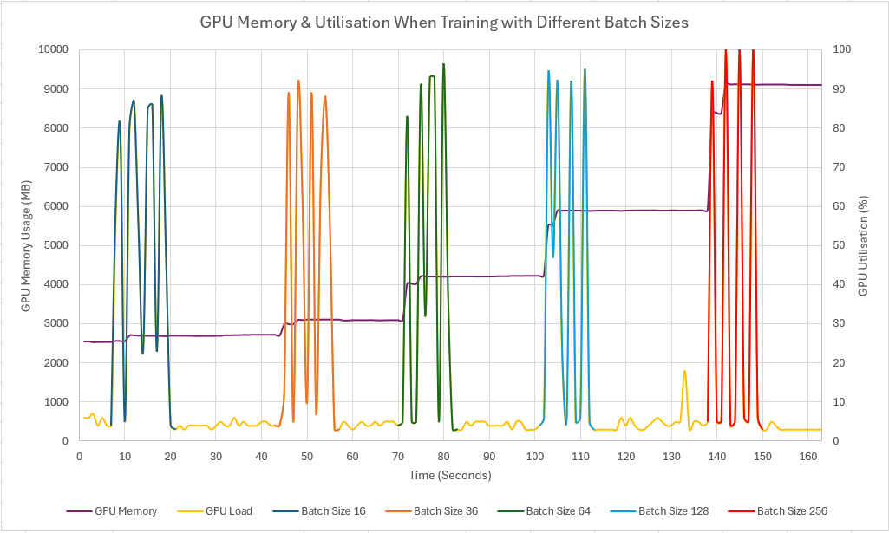
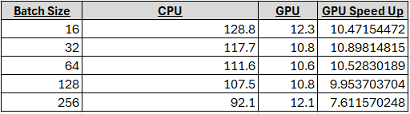

# The Power of the Batch Size

I was recently playing around with examining the GPU Memory Utilisation & GPU Load percentage as a result of Deep learning training. One interesting observation I made was that increasing the batch size to increase the entirety of the GPU memory, did not necessarily lead to an improved training time.

I dug a little further into this, and it turns out that lots of factors contribute to this non-linear relationship between batch size and training time. Some factors include I/O bottlenecks, CPU processing power and memory limitations.

## The Results of my Experiment

The results I observed, was that once the batch size was increased past the size of `64` the training time of the model began to once again increase. This resulted in an almost perfect parabolic relationship. For reference, I also ran the training runs without the GPu to note the baseline difference in speed between the CPU and the GPU.



Another observation with regards to the GPU video memory utilisation was that it was not being correctly released after training each batch size. This is because when working in a Jupyter notebook, the GPU memory is not released until the the kernel restarted or the memory is manually purged. In order to manually purge the memory the following line of code can be inserted after training the model to release the memory `torch.cuda.empty_cache()`.

I hope this gave you some insights into training time vs batch size tuning.
